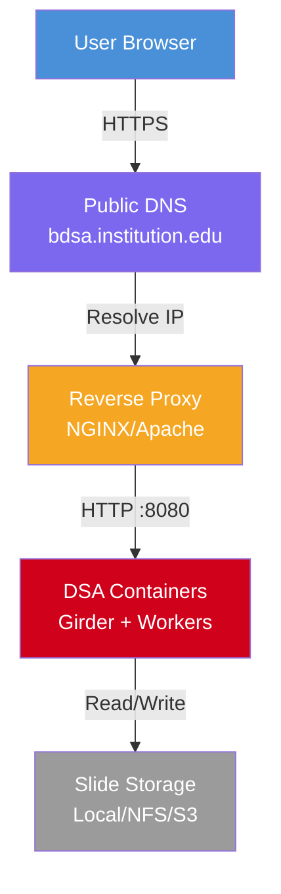
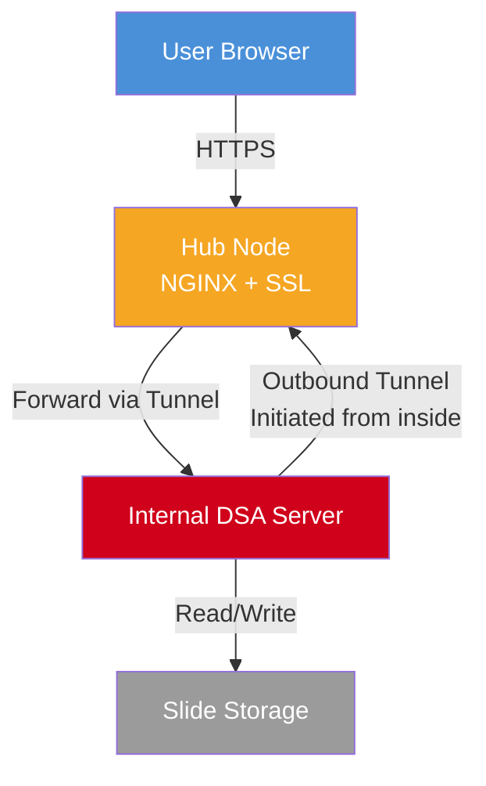
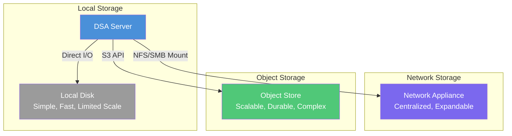
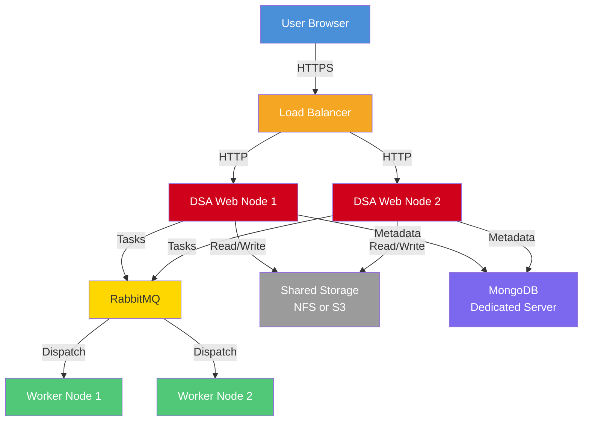
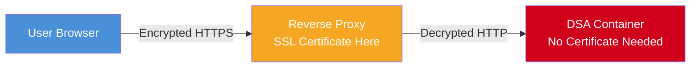

# Digital Slide Archive (DSA) Deployment Guide

> **Purpose:**
> This guide explains how to deploy a **Digital Slide Archive (DSA)** instance, from a quick container-based startup to production-scale deployment considerations.
> It is intended for both:

1. **Technical administrators** responsible for deployment.
2. **Non-technical stakeholders** who need to understand infrastructure requirements and decisions.

---

# Table of Contents

1. [Quickstart: From Zero to Running](#quickstart-from-zero-to-running)
2. [Deployment Architecture Options](#deployment-architecture-options)

   * [Option A: Public Internet Deployment](#option-a-public-internet-deployment)
   * [Option B: Secure Tunnel Deployment Behind Firewall](#option-b-secure-tunnel-deployment-behind-firewall)
3. [Infrastructure Decisions Guide](#infrastructure-decisions-guide)
4. [Detailed Deployment Steps](#detailed-deployment-steps)
5. [Storage Architecture Planning](#storage-architecture-planning)
6. [Scaling Considerations](#scaling-considerations)
7. [Security and SSL Deep Dive](#security-and-ssl-deep-dive)
8. [Secure Tunnel Deep Dive](#secure-tunnel-deep-dive)

---

# Quickstart: From Zero to Running

This section gets a DSA instance running on your local machine in minutes. This is **not yet a production deployment** it is a way to verify the software works and to begin exploring configuration before making infrastructure decisions.

## Prerequisites

Before starting, ensure you have:

- **Docker** and **Docker Compose** installed. If you are running on a desktop machine (Windows or macOS), Docker Desktop includes both. If you are running on a headless Linux server (the more common case for production), install Docker Engine and the Docker Compose plugin through your package manager (e.g., `apt install docker-compose-plugin` on Ubuntu). The Docker Compose V2 plugin is invoked as `docker compose` (with a space), not `docker-compose` (with a hyphen).
- **Git** installed
- At least **4 GB of RAM** available for containers (DSA services, the web app, database, and background workers, all run in containers simultaneously)
- At least **20 GB of free disk space** for the container images and a small test dataset

> **Why these requirements?** DSA runs as a multi-container stack: a MongoDB database, a RabbitMQ message broker, one or more Celery worker processes for background tasks (like tile generation), and the Girder-based web application itself. Each of these consumes memory and disk. The 4 GB minimum keeps the stack responsive even during initial data import.

## Launch the Stack

```bash
# 1. Clone the official repository
git clone https://github.com/DigitalSlideArchive/digital_slide_archive
cd digital_slide_archive/devops/dsa

# 2. Pull the latest container images
docker compose pull

# 3. Launch the stack
#    IMPORTANT: Do NOT run this as root/sudo/admin.
#    Running as root causes file ownership problems inside containers
#    and creates security risks on the host.
DSA_USER=$(id -u):$(id -g) docker compose up
```

> **Why `DSA_USER=$(id -u):$(id -g)`?** This passes your host user and group IDs into the container environment. DSA's worker processes write files (uploaded slides, generated tiles, logs) to mounted volumes. Without this, those files would be owned by root inside the container, making them unmanageable from the host. By matching the container user to your host user, files written by the container are naturally owned by you.

## Verify It's Running

After the containers start (this may take a minute on first launch), you need to access the DSA web interface. How you do this depends on where you are running the containers:

### Running on your local machine

If you launched the containers on the same machine where your browser is running, open a browser and navigate to:

```
http://localhost:8080
```

**What is localhost?** `localhost` is a special network name that always refers to the machine you are currently using. It maps to the IP address `127.0.0.1`. When you access `http://localhost:8080`, your browser connects to port 8080 on your own machine, which is where the DSA container is listening.

### Running on a remote/headless server

If you launched the containers on a separate server (e.g., a lab server or a VM in your institution's data center), you need the server's IP address instead of localhost. Open a browser on your own machine and navigate to:

```
http://<SERVER_IP>:8080
```

Replace `<SERVER_IP>` with the actual IP address of the server.

**How to find the server's IP address:**

- **On Linux/macOS:** Run `hostname -I` or `ip addr show` on the server. Look for the inet address on the primary network interface (not the `127.0.0.1` loopback address).
- **On Windows:** Run `ipconfig` on the server. Look for the IPv4 Address under the active network adapter.

> **Note:** If the server is on an internal network, you must be on that network (or connected via VPN) to reach it. If you cannot connect, check with your IT department about network access to the server.

### What to expect

You should see the DSA web interface. At this point:

- The application is running locally
- You can log in with the default admin account
- You can upload a test slide and verify tile generation works
- The system is **not accessible to other users** (only reachable from the local network)
- The system is **not using HTTPS** (traffic is unencrypted)
- The system is **not backed by production-grade storage**

The remaining sections of this guide address how to move from this local instance to a production-ready deployment. For details on securing the deployment, see [Security and SSL Deep Dive](#security-and-ssl-deep-dive). For details on the tunnel-based access model, see [Secure Tunnel Deep Dive](#secure-tunnel-deep-dive).

---

[Back to top](#table-of-contents)

---

# Deployment Architecture Options

Before configuring anything else, you must answer one fundamental question: **How will users reach the DSA server?**

This decision shapes every subsequent configuration step: DNS, SSL, firewall rules, and even storage layout all depend on the network topology you choose.

There are two primary models:

---

# Option A: Public Internet Deployment

In this model, the DSA server (or its reverse proxy) is directly reachable from the internet. Users navigate to a public URL like `https://bdsa.institution.edu`, and traffic flows directly to your server.

### Architecture Flow



The reverse proxy is the single entry point, handling SSL termination and forwarding to the DSA containers.

### Benefits

- **Simpler architecture:** Fewer moving parts. No tunnel to maintain, no relay server to monitor. One server handles everything (or a small cluster behind a load balancer).
- **Direct access:** Users connect straight to your infrastructure. Latency is determined by your server and network, not by an intermediary.
- **Easier certificate management:** Let's Encrypt and similar ACME-based certificate authorities can automatically verify domain ownership and renew certificates. This is harder when the domain does not resolve to the server holding the certificate.

### Requirements

- **Public IP or routable hostname** (a hostname is a human-readable name for a server on a network, like `bdsa.institution.edu`, that maps to an IP address): Your server must be reachable on the internet. This typically means your institution's IT department must assign you a public IP and configure routing. **Submit an IT ticket** to request a public IP and DNS record for your chosen hostname.
- **SSL certificates:** Mandatory. Without HTTPS, browser credentials are transmitted in plain text, and modern browsers will flag the site as insecure. See [Security and SSL Deep Dive](#security-and-ssl-deep-dive) for details.
- **Hardened firewall:** Because the server is directly exposed, you must carefully restrict which ports are open (typically only 80 and 443 for HTTP/HTTPS) and ensure the host OS is kept up to date.

### When to Choose This Option

Choose public deployment when your institution allows inbound internet traffic to research servers and you have IT support to manage firewall rules and DNS. This is the simpler path and is recommended unless institutional policy forbids it.

---

# Option B: Secure Tunnel Deployment Behind Firewall

In this model, the DSA server lives on an internal network behind a firewall that blocks all inbound connections. Instead of opening the firewall, a **secure tunnel** carries traffic from a public-facing **Hub node** to the internal DSA server.

The key insight is that the tunnel is established **outbound** from the internal server: the internal server connects out to the Hub node, and the Hub node bridges incoming user traffic through that connection. Since the firewall allows outbound connections, no inbound rules need to be opened.

### Architecture Flow



Note that the tunnel connection originates from the internal server (outbound), which is why no inbound firewall rules are needed.

### Benefits

- **Internal server remains private:** The machine hosting DSA and your slide data is never directly exposed to the internet. Even if the Hub node is compromised, the attacker cannot directly reach the internal server; they can only send traffic through the tunnel, which the internal server controls.
- **No inbound firewall openings required:** This is often the deciding factor. Many institutional IT policies prohibit opening inbound ports to research servers. The tunnel sidesteps this entirely because the connection originates from inside the network.
- **Easier compliance in restricted environments:** HIPAA, FISMA, and similar frameworks often require that servers handling sensitive data not be directly internet-accessible. The tunnel architecture satisfies this requirement while still allowing authorized users to access the system.

### Requirements

- **Public-facing Hub node:** A separate server (or VM) that is internet-accessible. This server runs a reverse proxy with SSL and the relay endpoint of the tunnel. The Hub node is the public-facing entry point that users connect to.
- **Reverse proxy and SSL on the Hub node:** The Hub node must present valid SSL certificates to user browsers, just as in the public deployment model.
- **Secure tunnel forwarding traffic to internal DSA server:** The tunnel is integrated into the system and must be configured and kept running reliably.
- **Network reachability from the private server to the Hub node:** The internal DSA server must be able to initiate an outbound connection to the Hub node (or to another server that can reach the Hub node). If the internal server's firewall blocks all outbound traffic, the tunnel cannot be established. Work with your IT department to ensure the internal server can reach the Hub node on the required port.

### When to Choose This Option

Choose tunnel deployment when your institution's IT policy prohibits inbound internet traffic to internal servers, or when your slide data is subject to compliance requirements that mandate network isolation. Be aware that this adds operational complexity: the tunnel is an additional service that must be monitored and maintained. For a detailed walkthrough, see [Secure Tunnel Deep Dive](#secure-tunnel-deep-dive).

---

[Back to top](#table-of-contents)

---

# Infrastructure Decisions Guide

Before proceeding to detailed configuration, work through these decisions with your team and IT department. Each decision affects the others, so it helps to address them in order.

---

## Networking

### What hostname will users access?

A **hostname** is a human-readable name that identifies your server on the network (for example, `bdsa.institution.edu`). Instead of typing a numeric IP address like `203.0.113.50`, users type the hostname, and DNS (the Domain Name System, which acts as a phonebook for the internet) translates it to the correct IP address.

Choose a stable, memorable hostname. This hostname will be used for:

- SSL certificate provisioning (certificates are bound to domain names)
- DNS configuration
- User bookmarks and integrations
- Any API clients that connect to DSA

> **Changing the hostname later is disruptive.** It requires new SSL certificates, DNS updates, and notifying all users. Choose carefully at the outset.
>
> **How to set up a hostname:** Submit an IT ticket to your institution's networking team requesting a DNS A record (or CNAME) for your chosen hostname pointing to your server's IP address. Your IT department will handle the DNS configuration.

### Is the DSA server public?

If the server has a public IP and can accept inbound connections, use **Option A** (public deployment). If the server is on an internal network with no inbound access, use **Option B** (tunnel deployment).

### Will a relay tunnel be required?

This is determined by the previous question. If the server is not public, you need a tunnel. Plan for:

- A public Hub node (can be a small VM)
- Monitoring to ensure the tunnel stays connected

### Which ports are open?

At minimum, the public-facing server (whether it is the DSA server itself or the Hub node) must accept:

- **Port 80** (HTTP): for redirecting to HTTPS and for ACME certificate validation
- **Port 443** (HTTPS): for all user traffic

All other ports should be closed at the firewall level. **Submit an IT ticket** to request that the appropriate ports be opened on the firewall.

---

## Security

### Who manages SSL certificates?

Determine whether your institution's IT department manages certificates or whether you will manage them yourself. This affects:

- Which certificate authority you use (institutional CA vs. Let's Encrypt vs. Sectigo vs. commercial CA)
- How renewals are handled (automated vs. manual)
- What the renewal schedule looks like (Let's Encrypt certificates expire every 90 days; commercial CAs typically issue 1-year certificates)

> **Institutional CA is the most common choice.** Most universities and research institutions have their own certificate authority or a contract with a commercial CA provider. Check with your IT department first before exploring other options.

### How are certificates renewed?

**Automated renewal is strongly recommended.** Let's Encrypt with Certbot can renew certificates automatically via cron or systemd timer. Sectigo, a widely used certificate management service, also provides automated renewal tools for institutional deployments. If your institution uses a different CA, ensure there is a documented renewal process.

> **What does it mean to renew a certificate?** SSL certificates have an expiration date (typically 90 days for Let's Encrypt, 1 year for most commercial CAs). After expiration, browsers will refuse to connect to your site. Renewal means obtaining a new certificate from the certificate authority before the old one expires, and installing it on your server. With automated renewal, this process runs on a schedule without manual intervention. Without it, someone must remember to request and install a new certificate before the old one expires, which is easy to forget and can cause unexpected outages.

An expired certificate will make the DSA instance inaccessible: browsers will refuse to connect.

### What authentication method will be used?

DSA supports several authentication methods:

- **Local accounts:** Users created directly in DSA. Simple but does not scale. Fine for small teams.
- **LDAP/Active Directory:** Integrates with your institution's directory service. Users log in with their institutional credentials.
- **OAuth via CILogon:** Delegates authentication to CILogon, a federated identity provider used by many research institutions. Users log in with their institutional credentials through CILogon's interface. This is the **recommended approach** for BDSA deployments.

> **Choose authentication before going live.** Changing authentication methods after users have created data and annotations is possible but requires careful migration.

#### CILogon Setup Overview

CILogon allows users to authenticate using their existing institutional credentials. Here is the high-level setup process:

1. **Register a CILogon client:** Navigate to [https://cilogon.org/oauth2/register](https://cilogon.org/oauth2/register) and fill out the registration form. Set the client name to your BDSA site name, the Home URL to your site's public domain (e.g., `https://bdsa.institution.edu`), and the callback URL to `https://bdsa.institution.edu/api/v1/oauth/cilogon/callback`. Set the Client Type to Confidential and request the scopes: `email`, `org.cilogon.userinfo`, and `profile`. After registration, save the client ID and client secret (you cannot retrieve the secret later).

2. **Configure the OAuth plugin in BDSA:** Log in to your BDSA server with an admin account. Go to Admin Console > Plugins, locate the "OAuth2 Login" plugin, and select the gear icon. Open CILogon from the list, enter your client ID and client secret, and save.

3. **Set the server root:** From the footer of the page, select "Web API". Find the "system" section and add the key `core.server_root` with the value set to your site URL (e.g., `https://bdsa.institution.edu)

> **For detailed, step-by-step instructions with screenshots, refer to the [BDSA CILogon Documentation](<link here>).**

---

## Storage

### How much WSI data is expected?

Whole-slide images (WSIs) are large: typically **500 MB to 5 GB per slide**, and some modalities (e.g., multi-frame fluorescence) can exceed **10 GB per slide**. A collection of 1,000 slides can easily require 2-5 TB of storage.

Estimate your storage needs based on:

- Number of slides you expect to import
- Average slide size for your scanner/scanning protocol
- Growth rate (slides per week/month)

> **Always over-provision storage by at least 50%.** Slide collections grow faster than expected, and running out of disk space during an import can corrupt data.

### Will storage be expandable?

Plan for growth from the start. Options include:

- Starting with a large local disk that has room to grow
- Using LVM or ZFS on the host to allow volume expansion
- Using network or object storage, which can be expanded without downtime

### Is backup storage available?

Backups must be stored separately from the primary storage. If the primary storage fails, the backup must still be accessible. Consider:

- Off-site or cloud backup for disaster recovery
- Regular backup testing (a backup that hasn't been tested is not a backup)
- Whether you need to back up the entire slide data or only the metadata/database (slide files may be re-importable from the original source if the database is preserved)

---

## Operations

### Who monitors uptime?

Someone must be responsible for noticing when the DSA instance is down. Options include:

- A dedicated operations team
- Automated monitoring (e.g., UptimeRobot, Prometheus + Alertmanager, or a simple cron-based health check)
- On-call rotation for after-hours issues

### Who applies updates?

DSA releases updates periodically. Someone must:

- Test updates in a staging environment
- Apply updates to production
- Verify the update didn't break anything

### Who handles backups?

Backups must be:

- Taken on a regular schedule (daily for the database; slide data backup frequency depends on import rate)
- Verified periodically
- Restorable in a documented procedure

See the expanded backup operations section under [Scaling Considerations](#scaling-considerations) for details on what taking backups looks like in practice.

---

[Back to top](#table-of-contents)

---

# Detailed Deployment Steps

---

## Step 1: Launch DSA Containers

Use the GitHub-provided Docker deployment to start the full DSA stack:

- **Girder web application:** The core web server that provides the DSA API and UI
- **MongoDB:** The database storing metadata, user accounts, annotations, and collection structure
- **RabbitMQ:** The message broker that dispatches background tasks to workers
- **Celery workers:** Background processes that handle tile generation, file import, and other long-running tasks

```bash
git clone https://github.com/DigitalSlideArchive/digital_slide_archive
cd digital_slide_archive/devops/dsa
docker compose pull
DSA_USER=$(id -u):$(id -g) docker compose up -d
```

> **Why `-d`?** The `-d` flag runs containers in the background (detached mode). For initial testing, you may want to omit `-d` to see logs in the terminal. For production, use `-d` and manage logs through Docker's logging driver.

This provides the application runtime environment but **does not expose a secure public service**. The containers listen on localhost only, without encryption.

---

## Step 2: Configure Reverse Proxy

The reverse proxy sits between users and the DSA containers. It serves several critical functions. For a deeper explanation of why the reverse proxy handles SSL termination, see [Security and SSL Deep Dive](#security-and-ssl-deep-dive).

### What the Reverse Proxy Does

1. **Receives user HTTPS traffic:** All browser connections arrive at the proxy on port 443.
2. **Presents SSL certificate:** The proxy holds the SSL certificate and handles the TLS handshake. This means the DSA containers never need to know about certificates.
3. **Routes requests to DSA containers:** The proxy forwards decrypted HTTP traffic to the DSA container (typically on port 8080).
4. **Enforces timeout settings:** Slide processing can take time. The proxy must be configured with generous timeout limits, or long-running requests will fail.

### Why a Reverse Proxy Is Required

You might wonder: why not expose the DSA container directly? Several reasons:

- **SSL termination:** Managing certificates inside the application container is fragile and makes renewal harder. The proxy centralizes certificate management.
- **Security:** The proxy is a controlled entry point. It can rate-limit requests, block suspicious traffic, and enforce connection policies that the application does not handle.
- **Request buffering:** For large uploads, the proxy can buffer the request before passing it to the application, protecting the application from slow-client attacks.

### Choosing and Configuring a Reverse Proxy

The two most common choices for DSA deployments are:

- **NGINX:** Excellent performance, widely used, and extensive documentation. NGINX is the most common choice for DSA deployments. For setup instructions, see the [official NGINX reverse proxy documentation](https://docs.nginx.com/nginx/admin-guide/web-server/reverse-proxy/).
- **Apache:** Mature, flexible module system. If your institution already uses Apache for other services, it may be easier to use Apache for consistency. For setup instructions, see the [official Apache reverse proxy documentation](https://httpd.apache.org/docs/2.4/howto/reverse_proxy.html).

> **Which should you choose?** If you do not have an existing preference, NGINX is recommended for its simpler configuration syntax and strong performance. If your institution's IT team is more familiar with Apache, use Apache.

### Critical Configuration for DSA

Regardless of which proxy you choose, you **must** configure:

- **Proxy timeouts:** Slide processing can take minutes. Set proxy read timeouts to at least 300 seconds.
- **WebSocket support:** DSA uses WebSockets for some real-time features. Ensure the proxy passes WebSocket upgrade headers.

> **Note on upload size limits:** In a typical BDSA deployment, users do not directly upload slide files through the browser. Instead, slides are stored in **assetstores** (configured storage locations that DSA manages). The assetstore configuration handles file size limits, so the reverse proxy's client body size limit is less critical than it would be for direct browser uploads. However, if you do allow direct browser uploads, set the client body size limit to at least the size of your largest expected slide (e.g., `client_max_body_size 10G` in NGINX).

---

## Step 3: Configure DNS

DNS (the Domain Name System) maps your chosen hostname to the server's IP address:

```text
bdsa.institution.edu → 203.0.113.50
```

### Why DNS Matters

Without DNS, users must access DSA via IP address (e.g., `https://203.0.113.50`). This causes several problems:

- **SSL certificates are bound to domain names**, not IP addresses. A certificate for `bdsa.institution.edu` will not validate when users connect via IP. Browsers will show security warnings.
- **IP addresses can change** if you migrate to a new server. DNS provides a stable name that can be repointed.
- **User experience:** A hostname is memorable; an IP address is not.

### DNS Configuration

**Submit an IT ticket** to your institution's networking team requesting a DNS A record (or CNAME) pointing your chosen hostname to the server's public IP. If using a tunnel deployment, the DNS record should point to the **Hub node's** IP, not the internal DSA server.

---

## Step 4: Provision SSL Certificates

**SSL (Secure Sockets Layer)**, now more accurately called **TLS (Transport Layer Security)**, is the protocol that encrypts data sent between a user's browser and the server. When you see `https://` in a URL, the "s" means the connection is using SSL/TLS. SSL certificates are digital files that enable this encrypted connection and verify the server's identity.

SSL/TLS certificates provide three essential functions:

1. **Encryption:** All traffic between the user's browser and the server is encrypted. Without this, credentials, patient data, and research data are transmitted in plain text that anyone on the network can read.
2. **Identity verification:** The certificate proves that the server is actually the server the user intends to connect to, not an impostor posing as your site.
3. **Browser trust:** Modern browsers require valid SSL certificates. Without one, browsers display prominent warnings that most users will not bypass.

### What Happens Without Valid SSL

- Browsers display "Not Secure" warnings that erode user confidence
- Login credentials are transmitted in plain text and can be intercepted
- Some DSA integrations (e.g., API clients, annotation tools) may refuse to connect
- WebSocket connections may fail (some browsers block mixed-content WebSockets)

### Certificate Options

| Option | Cost | Renewal | Best For |
|--------|------|---------|----------|
| **Institutional CA** | Varies (often free) | Varies (often automated) | Most deployments; check with your IT department first |
| **Let's Encrypt** | Free | Automated (90-day) | When institutional CA is not available |
| **Sectigo** | Varies (institutional licensing) | Automated tools available | Institutions that use Sectigo's certificate management platform |
| **Commercial CA** | Paid | Manual or semi-automated (1-year) | When institutional policy requires a specific commercial CA |

> **Start with your institution's IT department.** Most institutions have an established process for provisioning SSL certificates. They may use an internal CA, a contract with a provider like Sectigo, or Let's Encrypt. Using the institutional process is almost always the easiest path.

---

## Step 5: Configure Storage Mounts

The DSA container must be able to access:

- **WSI files:** The original whole-slide image files. These are the core data that DSA serves.
- **Asset storage:** Generated tiles, thumbnails, and other derived assets. DSA creates these from the original WSI files and stores them in configured assetstores.
- **Upload directories:** Temporary storage for files being uploaded before they are processed and moved to permanent storage.

### Mount Options

- **Local disk mounts:** Bind-mount a directory from the host into the container. Simplest option. Ensure the directory has enough space for your collection.
- **Network shares (NFS/SMB):** Mount a network share on the host and bind-mount it into the container. Useful for centralized storage but requires careful attention to mount reliability and performance.
- **Object storage connectors:** DSA can use S3-compatible object storage via Girder's S3 assetstore adapter. This is the most scalable option but requires additional configuration.

> **Test with a real slide early.** Before committing to a storage architecture, upload a full-size WSI and verify that tile generation completes successfully. Some network storage configurations have latency or locking characteristics that cause issues with DSA's tile generation process.

---

[Back to top](#table-of-contents)

---

# Storage Architecture Planning

Storage is often the **largest and most consequential deployment decision** for a DSA instance. Whole-slide images are among the largest files commonly served over the web, and the storage architecture you choose affects performance, cost, reliability, and scalability.



This diagram helps stakeholders understand the tradeoffs between storage options at a glance.

---

## Option 1: Local Storage

Slides are stored on disks directly attached to the DSA server (e.g., internal SSDs or HDDs, or directly attached RAID arrays).

### Pros

- **Simple:** No network configuration, no mount reliability issues, no access control planning. Files are just on disk.
- **Fast local access:** Direct disk I/O is the lowest-latency option. DSA's tile server reads small regions of large files frequently, so low-latency reads directly impact user experience (how quickly a slide loads when panning/zooming).

### Cons

- **Harder to scale:** When the disk fills up, you must add more disks to the same server or migrate to larger disks. This typically requires downtime.
- **Harder to share across nodes:** If you later add a second DSA web node for load balancing, it cannot access the same local storage. You would need to migrate to network or object storage at that point.

### When to Choose

Local storage is ideal for **single-server deployments** with a **known, bounded collection size**. If you expect fewer than a few thousand slides and do not plan to scale to multiple web nodes, local storage is the simplest and fastest option.

---

## Option 2: Network Storage

Slides are stored on mounted network storage (NFS, SMB/CIFS, or similar). The DSA server accesses files through a network mount point.

### Pros

- **Centralized:** Multiple servers can access the same storage. This enables multi-node deployments and simplifies backup.
- **Expandable:** Network storage appliances can often be expanded without downtime by adding shelves of disks. Your storage grows independently of your compute.

### Cons

- **Network bottlenecks:** Every tile read traverses the network. For a single user, this is fine. For 20 concurrent users panning and zooming, the network can become a bottleneck. 10 GbE or faster networking is recommended.
- **Mount reliability matters:** If the network mount drops (due to network issues, storage appliance maintenance, etc.), DSA loses access to all slide data. The mount must be configured with robust retry and timeout settings, and you should test how DSA behaves when the mount is temporarily unavailable.

### When to Choose

Network storage is a good middle ground for **medium deployments** (hundreds to low thousands of slides) where you need **centralized management** or plan to run **multiple DSA nodes**. Ensure your network infrastructure can handle the bandwidth.

---

## Option 3: Object Storage

Slides are stored in S3-compatible object storage (AWS S3, MinIO, Azure Blob Storage, etc.). DSA accesses files through the S3 API.

### Pros

- **Scalable:** Object storage is designed for massive scale. You will not run out of space. Petabyte-scale collections are routine for object storage.
- **Durable:** Object storage systems replicate data across multiple physical locations. The risk of data loss is extremely low.
- **Easier distributed deployments:** Any number of DSA nodes can access the same object storage simultaneously without mount-related consistency issues.

### Cons

- **More setup complexity:** You must configure an S3-compatible endpoint, create buckets, set up access credentials, and configure DSA's S3 assetstore adapter. This is more involved than pointing at a local directory.
- **Access control planning required:** Object storage has its own access control model (IAM policies, bucket policies, pre-signed URLs). You must decide how DSA authenticates to the storage and whether other systems also need access.

### When to Choose

Object storage is the best choice for **large or growing collections** (thousands of slides and beyond), **multi-node deployments**, and **cloud-hosted DSA instances**. The upfront complexity pays off in scalability and durability.

---

[Back to top](#table-of-contents)

---

# Scaling Considerations

A small DSA deployment (a few dozen users, a few hundred slides) runs comfortably on a single server. As usage grows, you may need to scale individual components. The key principle is to **scale components independently**: do not add more web servers if the bottleneck is the database.



This diagram illustrates an enterprise-scale deployment with independent scaling of web nodes, workers, storage, and database.

---

## Compute Scaling

As user count grows, separate the DSA stack into independent components that can be scaled individually:

- **Web application nodes:** The Girder web server that handles API requests and serves the UI. Add more nodes behind a load balancer to handle more concurrent users.
- **Background workers:** Celery workers that process tile generation, file imports, and analysis tasks. Add more workers to process more slides in parallel. Workers are often the first bottleneck, since tile generation is CPU-intensive.
- **Database:** MongoDB stores all metadata. For most deployments, a single well-configured MongoDB instance is sufficient. Very large deployments may benefit from replica sets for read scaling and high availability.

> **Start by scaling workers first.** In most DSA deployments, the limiting factor is tile generation throughput, not web request capacity. Adding worker processes (or worker nodes) gives the most immediate performance improvement.

---

## Storage Scaling

As your slide collection grows, consider the tradeoffs of **cloud-based object storage**:

- **Cost vs. convenience:** Cloud storage (AWS S3, Azure Blob, Google Cloud Storage) charges per GB stored and per request. For large collections, monthly costs can be significant, but you eliminate the need to manage physical disks and capacity planning.
- **Speed vs. cost:** Cloud storage access latency is higher than local disk. For frequently accessed slides, this may be noticeable. Some providers offer tiered pricing: hot storage (fast, expensive) for active data and cool/archive storage (slower, cheaper) for infrequently accessed data.
- **Durability:** Cloud providers replicate data across multiple data centers, providing extremely high durability (typically 99.999999999% per year). This is hard to match with on-premises storage.
- **No capacity planning:** Cloud storage scales automatically. You never need to add disks or expand volumes. This removes a significant operational burden.

> **If you started with local or network storage and are running into capacity limits, migrating to object storage (cloud or on-premises MinIO) eliminates the capacity planning problem entirely.**

---

## Database Scaling

Large deployments may need:

- **Dedicated database server:** Running MongoDB on the same server as the web application works for small deployments, but the database benefits from dedicated RAM and disk I/O. Moving MongoDB to its own server (or using a managed MongoDB service) improves performance and reliability.
- **Managed backups:** MongoDB backups should be taken using `mongodump` or filesystem snapshots on a regular schedule. For production deployments, automate this and store backups off-server.
- **Performance tuning:** MongoDB performance depends on having enough RAM to keep the working set in memory. Monitor page fault rates and increase RAM if the database is frequently reading from disk.

---

## Backup Operations

Taking backups is not just about running a command once. It is an ongoing operational process. Here is what it looks like in practice:

### Database Backups

The MongoDB database contains all metadata: user accounts, collection structures, annotations, and permissions. Losing this data means losing the organizational structure of your entire slide archive, even if the slide files themselves are preserved.

- **Schedule:** Run `mongodump` daily (or more frequently for active deployments). Automate this with a cron job or systemd timer.
- **Storage:** Store backup files on a separate server or in cloud storage (e.g., an S3 bucket). Never store backups on the same server as the database.
- **Retention:** Keep at least 7 days of daily backups, 4 weeks of weekly backups, and 12 months of monthly backups. Adjust based on your recovery needs.
- **Verification:** Periodically restore a backup to a test environment and verify that the data is intact. A backup that has never been restored is not a verified backup.

### Slide Data Backups

Slide files (the WSI data) are much larger than the database. Your backup strategy depends on whether the original source files are still available:

- **If originals are still accessible** (e.g., on the scanner's local storage or an institutional archive), you may choose to back up only the database and re-import slides if needed. This saves significant storage but requires access to the original files for recovery.
- **If originals are not accessible**, you must back up the slide files themselves. Given the size of WSI data (multi-TB), consider using cloud storage or a dedicated backup appliance. Schedule backups based on import frequency: if you import slides weekly, a weekly backup may suffice.

### Testing and Documentation

- **Document the restore procedure:** Write down the exact steps to restore from backup, including commands and expected output. During an emergency is not the time to figure this out.
- **Test restores quarterly:** Restore to a test server and verify that DSA works correctly with the restored data. This catches problems with the backup process before they matter.
- **Assign responsibility:** Make sure a specific person (or team) is responsible for monitoring backup jobs and responding to failures.

---

## Observability

You cannot manage what you cannot see. Implement observability from the start:

- **Monitoring:** Track CPU, memory, disk usage, and container health. Tools like Prometheus + Grafana, Datadog, or even simple Docker health checks provide visibility into system state.
- **Centralized logs:** Aggregate logs from all containers (web app, workers, database) into a single location. This is essential for troubleshooting. Tools like the ELK stack (Elasticsearch, Logstash, Kibana) or Loki make it possible to search and correlate logs across services.
- **Alerting:** Configure alerts for critical conditions: disk space running low, containers restarting, database connection failures, or the tunnel going down (if using Option B). Alerts should go to the person who can act on them, not to a mailing list.

> **Observability is generally managed by the development team.** The team responsible for the DSA deployment should set up monitoring and alerting, and make dashboards and status pages easily available to users so they can check system health without needing technical access.

---

[Back to top](#table-of-contents)

---

# Security and SSL Deep Dive

SSL/TLS is not optional for a production DSA deployment. This section explains why and how it works.

## What Is SSL and Why Is It Critical for Security?

**SSL (Secure Sockets Layer)**, more accurately called **TLS (Transport Layer Security)** in modern usage, is the standard technology for encrypting data sent between a web browser and a web server. When you visit a URL that starts with `https://`, the "s" stands for "secure" and means the connection is encrypted using SSL/TLS.

Without SSL/TLS encryption, everything sent between the browser and the server, including usernames, passwords, and slide data, travels across the network in plain text. Anyone who can intercept the network traffic (which is trivial on shared Wi-Fi networks and possible on institutional networks) can read everything. SSL/TLS prevents this by encrypting the data so that only the intended recipient can read it.

## Why SSL Matters

Without SSL:

- **Traffic can be intercepted:** Anyone on the network path between the user and the server can read all traffic, including login credentials and slide data. On public Wi-Fi or shared institutional networks, this is a real threat.
- **Browsers show warnings:** Modern browsers display increasingly aggressive warnings for HTTP sites, especially those with login forms. Users will not trust the site.
- **Authentication is vulnerable:** Without encryption, session cookies can be stolen via network sniffing, allowing an attacker to impersonate a logged-in user.

## SSL Flow

```text
Browser requests https://bdsa.institution.edu
↓
Server presents SSL certificate
↓
Browser validates certificate (checks CA signature, expiration, domain match)
↓
Encrypted session established (TLS handshake complete)
↓
All traffic between browser and server is encrypted
↓
Reverse proxy decrypts and forwards to DSA containers over internal HTTP
```

## Why the Reverse Proxy Terminates SSL

You might wonder why the reverse proxy handles SSL instead of the DSA application itself. There are several important reasons:

1. **Separation of concerns:** The application should focus on serving content, not managing certificates. Certificate renewal, rotation, and configuration are infrastructure concerns, not application concerns.
2. **Certificate management:** Tools like Certbot are designed to work with web servers (NGINX, Apache). They can automatically renew certificates and reload the proxy. Doing this inside the application container is fragile and makes updates harder.
3. **Centralized security policy:** The proxy can enforce security headers (HSTS, CSP), rate limiting, and connection policies in one place, rather than scattering these concerns across the application.
4. **Container portability:** If the application does not need to know about certificates, the same container image works in any environment (development, staging, production) without modification.



This diagram highlights where encryption ends and internal forwarding begins. The DSA container never handles certificates; the proxy centralizes this responsibility.

---

[Back to top](#table-of-contents)

---

# Secure Tunnel Deep Dive

For environments where the DSA server cannot be directly exposed to the internet, a secure tunnel provides access without compromising network isolation. This is the architecture used in [Option B: Secure Tunnel Deployment Behind Firewall](#option-b-secure-tunnel-deployment-behind-firewall).

## How It Works

1. **Internal DSA server initiates an outbound tunnel connection** to the Hub node. This is a persistent connection maintained by the integrated tunnel system.
2. **Hub node accepts HTTPS traffic** from user browsers. It presents the SSL certificate and terminates TLS, just like a standard reverse proxy.
3. **Hub node forwards traffic over the tunnel** to the internal DSA server. The tunnel carries the decrypted HTTP request from the Hub node to the internal server.
4. **Internal server processes the request and responds** through the same tunnel path back to the user.

```text
User Browser
 ↓ HTTPS
Hub Node (NGINX + SSL)
 ↓ Tunnel (encrypted)
Internal DSA Server
 ↓
Slide Storage
```

## Why This Matters

The tunnel architecture provides a critical security property: **the internal server never accepts inbound connections from the internet.** The firewall can block all incoming traffic, and the DSA instance is still accessible because the tunnel connection originates from inside the network.

This is often required for:

- **Institutional firewalls:** Many universities and research institutions have IT policies that prohibit opening inbound ports to internal servers.
- **Restricted networks:** Networks handling sensitive data (e.g., clinical data, IRB-protected research) often have strict network isolation requirements.
- **Compliance environments:** Frameworks like HIPAA, FISMA, and NIST 800-53 may require that servers not be directly accessible from the internet.

## Tunnel Setup Considerations

When implementing a tunnel, document the following:

1. **How the tunnel is established:** The tunnel is integrated into the system. Document how it is configured and how the connection is initiated.
2. **Which ports are forwarded:** Typically only HTTP (port 8080 internally) needs to be forwarded through the tunnel.
3. **Authentication between Hub node and internal node:** The tunnel must be authenticated so that only your internal server can connect to your Hub node. Use the authentication mechanism built into the integrated tunnel system.
4. **Failure handling:** What happens when the tunnel drops? The internal server should automatically reconnect. The Hub node should return a meaningful error page (not a connection timeout) when the tunnel is down. Monitor tunnel health and alert on disconnections.

---

[Back to top](#table-of-contents)

---

# Final Notes

The container deployment is only the **first step**. A production DSA deployment also requires:

- **Secure access architecture:** SSL, DNS, and a reverse proxy (or tunnel) so users can reach the system safely
- **Storage planning:** Enough capacity for your slide collection, with a growth plan
- **SSL and DNS:** A stable hostname and valid certificates, configured for automatic renewal
- **Backup strategy:** Regular, tested backups of both the database and slide data
- **Monitoring and scaling plans:** Visibility into system health and a path to scale as usage grows

The most important early decisions are:

1. **How users access the system:** This determines your network architecture, SSL configuration, and firewall requirements.
2. **Where slide data lives:** This determines your storage architecture, backup strategy, and scalability path.
3. **How security is enforced:** This determines your authentication method, certificate management, and compliance posture.

These three decisions are foundational: they determine the rest of the deployment design and are expensive to change later. Invest the time to make them correctly at the outset.
